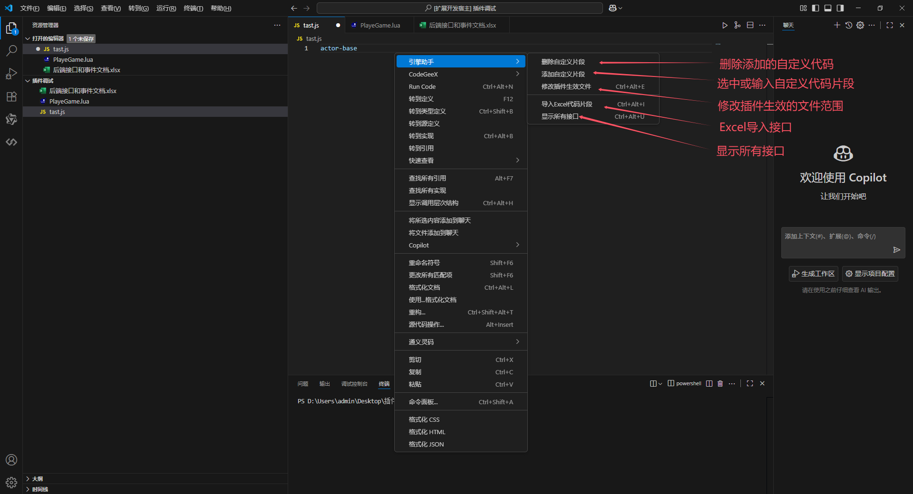
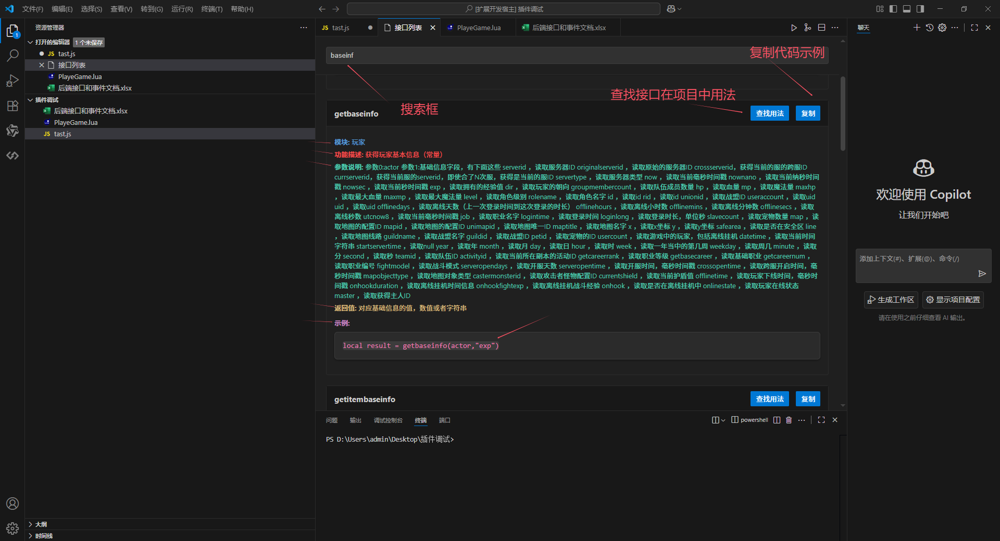
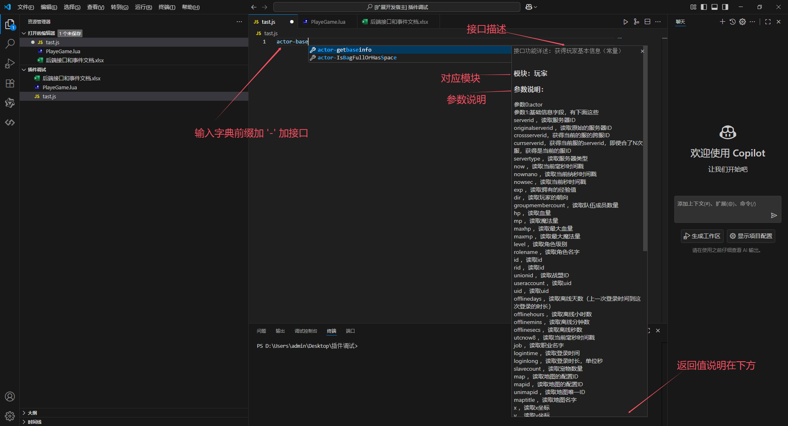
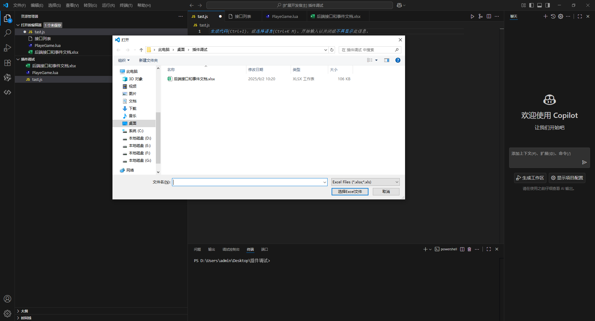
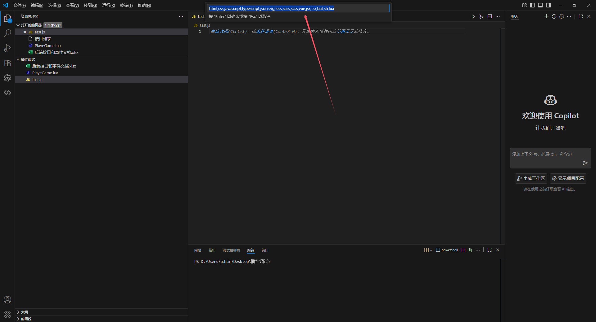
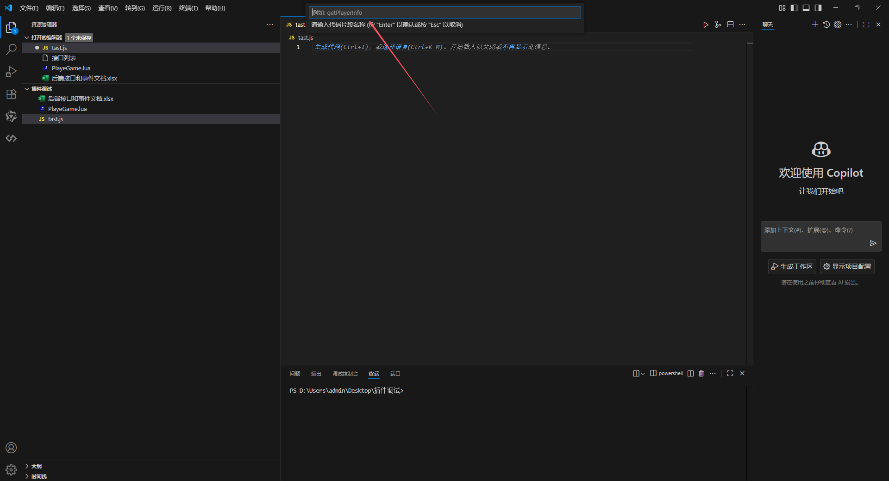

# 代码接口保存复用插件

## 介绍

代码接口保存复用 VS Code 插件，支持保存、管理和复用代码接口，提升开发效率。通过可视化界面和智能提示，帮助开发者快速访问和插入常用代码接口。

## 功能特性

- ✅ 代码接口保存与管理
- ✅ 代码接口自动补全提示
- ✅ 可视化代码接口浏览
- ✅ 自定义代码接口
- ✅ Excel 导入导出功能
- ✅ 代码接口查找用法
  

## 一、基础功能使用

### 1. 查询接口

选中显示所有接口，打开接口查询页面，系统会显示所有接口：



### 2. 代码接口自动补全

在代码编辑过程中，插件会根据已保存的代码接口提供智能补全提示：



### 3. 从 excel 文档中导入接口

选中导入 excel 接口，系统会提示选择导入文件，批量导入并覆盖原接口：



### 4. 配置代码补全语言类型

配置代码补全语言标识符，控制在哪些语言文件中触发代码接口补全功能，默认支持：
`html,css,javascript,typescript,json,svg,less,sass,scss,vue,jsx,tsx,bat,sh,lua`



### 5. 自定义代码接口

选中需要保存的代码，选中保存自定义代码片段，系统会提示输入自定义名称等信息：



### 6. 删除义代码接口

选中删除自定义代码片段，系统会提示删除对应代码

## 三、代码接口格式

代码接口包含以下信息字段：

- **模块**：代码接口所属模块（如：用户模块、订单模块等）
- **接口功能详述**：详细描述代码接口的功能
- **参数说明**：参数详细说明
- **返回参数**：返回值说明
- **示例**：代码示例

### 变量替换

代码接口支持以下变量自动替换：

- `filename`：自动替换为当前文件名
- `TM_FILENAME_BASE`：VS Code 内置变量，替换为文件名（不包含扩展名）

### 模块别名

常用模块会自动转换为英文别名，便于识别：
转换字典：

```json
{
  "定时器": "timer",
  "通用": "common",
  "文件操作": "file",
  "属性": "attr",
  "地图": "map",
  "怪物": "mon",
  "玩家": "actor",
  "离线挂机": "offline",
  "掉落": "drop",
  "物品和装备": "item_equip",
  "装备和物品": "item_equip",
  "背包和仓库": "bag",
  "组队": "team",
  "技能": "skill",
  "buff": "buff",
  "交易和商店": "trade",
  "战斗": "fight",
  "邮件": "email",
  "好友": "friend",
  "聊天": "chat",
  "变量操作": "var",
  "任务": "task",
  "商业化": "trade",
  "活动": "acti",
  "副本": "dup",
  "角色": "actor",
  "坐骑": "mount",
  "交易行": "trade",
  "战盟": "union",
  "摊位": "stall",
  "宠物": "pet",
  "系统": "sys",
  "道具": "item",
  "召唤兽": "pet",
  "时间日期": "date",
  "人物": "actor",
  "npc": "npc",
  "NPC": "npc",
  "全局数据接口": "var",
  "匹配": "match"
}
```

## 四、快捷键汇总

-- 暂时屏蔽

| 功能         | Windows/Linux    | Mac             |
| ------------ | ---------------- | --------------- |
| 保存代码接口 | `Ctrl + Alt + S` | `Cmd + Alt + S` |
| 插入代码接口 | `Ctrl + Alt + I` | `Cmd + Alt + I` |
| 删除代码接口 | `Ctrl + Alt + D` | `Cmd + Alt + D` |
| 编辑配置文件 | `Ctrl + Alt + E` | `Cmd + Alt + E` |

通过这个插件，您可以一定程度上减少查找时间， 减少重复代码的编写时间。
